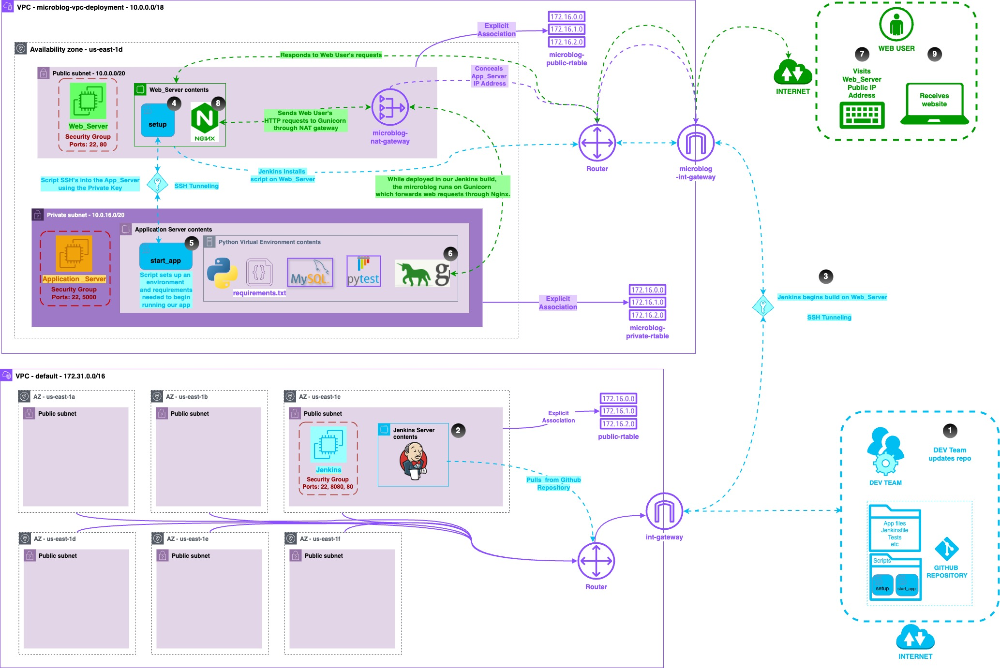

# Microblog VPC Deployment

A secure, self-managed deployment architecture for a social media style microblog on AWS. This project moves from a single public instance deployment to a segmented VPC design with separate web, application, deployment, and monitoring responsibilities.

## Why this exists

Earlier deployments ran Jenkins, the application server, and web access on the same instance in a public subnet. That approach is convenient, but it increases risk and makes performance unpredictable when build activity competes with production traffic.

This workload implements a more production style baseline:

- **Security**: application runtime lives in a **private subnet**
- **Reliability**: deployment tooling runs separately from production runtime
- **Controlled access**: a **public web server** proxies requests to the private application server
- **Observability**: a **monitoring server** collects and visualizes metrics

## Architecture summary

**Network**
- Custom VPC with a **public subnet** and **private subnet**
- Internet Gateway for the public subnet
- NAT Gateway in the public subnet to give the private subnet outbound internet access for updates and dependencies

**Compute roles**
- **Jenkins (Deployment server)**: triggers builds, tests, security checks, and deployment actions
- **Web Server (Public subnet)**: Nginx reverse proxy, entry point for user traffic
- **Application Server (Private subnet)**: runs the microblog app behind the proxy
- **Monitoring Server**: Prometheus and Grafana for metrics and dashboards

## Request flow

1. User hits the **Web Server** public IP or DNS
2. Nginx forwards traffic to the **Application Server** private IP on port 5000
3. Application responds through the proxy
4. Monitoring server scrapes metrics and Grafana visualizes them

## Repository layout

- `app/` application code
- `scripts/` automation scripts used for remote setup and deployment
- `Jenkinsfile` CI pipeline definition
- `tests/` test coverage used in the pipeline
- `Diagram.jpg` architecture diagram

## Key implementation details

### VPC and routing
- Public subnet routes to the Internet Gateway
- Private subnet routes outbound traffic through the NAT Gateway
- Private subnet does not accept inbound traffic from the internet

### Web and application separation
- Nginx runs on the web server and proxies requests to the application server
- The application server is only reachable from allowed sources (web server, authorized admin paths) via security group rules

### SSH access pattern
The application server is in a private subnet, so administrative access is handled through controlled SSH paths:
- Web Server can SSH to the Application Server using the application key pair
- Jenkins connects to the Web Server, then triggers setup actions that reach the application server

### Automation scripts
Scripts handle cross host setup and deployment steps so the pipeline can:
- install dependencies
- configure runtime
- start the application service in the background
- coordinate actions across servers without manual command entry

## System Diagram

## Implementation Steps

### 1. Repository setup

I began by cloning the repository and standardizing the project name as `microblog_VPC_deployment`. Keeping the repository name consistent ensured that scripts, Jenkins jobs, and documentation aligned cleanly throughout the build.

### 2. Custom VPC creation

I created a custom VPC in AWS with a single availability zone containing:

* One public subnet
* One private subnet

DNS hostnames and DNS resolution were enabled to allow internal name resolution between instances. A NAT Gateway was provisioned in the public subnet to allow the private subnet to access the internet securely for package installation and updates, without exposing private resources directly.

### 3. Public subnet configuration

I configured the public subnet to automatically assign public IPv4 addresses. This allowed instances launched in the subnet to be reachable from the internet when required, such as the web server and deployment tooling.

### 4. Deployment server setup (Jenkins)

In the default VPC, I provisioned an EC2 t3.medium instance dedicated to Jenkins. This server was responsible for:

* Pulling application code
* Running tests
* Performing security checks
* Coordinating deployments

Separating Jenkins from the application VPC reduced risk and prevented build activity from impacting production workloads.

### 5. Web server provisioning

Within the public subnet of the custom VPC, I created a t3.micro instance designated as the Web Server. Its security group allowed inbound traffic on:

* Port 22 for administrative access
* Port 80 for HTTP traffic

This server acts as the public entry point to the application.

### 6. Application server provisioning

In the private subnet of the same VPC, I created a t3.micro instance designated as the Application Server. Its security group allowed:

* Port 22 for controlled SSH access
* Port 5000 for internal application traffic

A key pair was created and stored locally to support secure access paths. The application server has no direct exposure to the internet.

### 7. Establishing secure SSH trust

On the Jenkins server, I generated an SSH key pair using `ssh-keygen`. I added the public key to the `authorized_keys` file on the Web Server. This allowed Jenkins to securely connect to the Web Server without password based authentication.

I validated the connection by SSHing from Jenkins into the Web Server, which also registered the Web Server as a known host. This step ensured trust was established before automating deployments.

### 8. Nginx reverse proxy configuration

On the Web Server, I installed Nginx and configured it as a reverse proxy. Incoming HTTP requests are forwarded to the Application Server using its private IP and application port.

This setup allows:

* Public traffic to terminate at the web layer
* The application server to remain isolated in a private subnet
* Clear separation between web and application concerns

The configuration was validated using `nginx -t` and then applied by restarting Nginx.

### 9. Application server access from the web layer

To allow the Web Server to initiate actions on the Application Server, I securely transferred the application server key pair to the Web Server. This enabled controlled SSH access from the web layer into the private application environment.

I verified connectivity by SSHing from the Web Server into the Application Server.

### 10. Deployment automation scripts

I created two scripts to automate cross server setup and deployment:

* `start_app.sh` runs on the Application Server and is responsible for:

  * Installing dependencies
  * Cloning the application repository
  * Installing Python packages
  * Setting environment variables
  * Starting the application using Gunicorn in the background

* `setup.sh` runs on the Web Server and SSHs into the Application Server to execute `start_app.sh`

These scripts allow the pipeline to coordinate actions across multiple hosts while maintaining execution context.

### 11. Jenkins pipeline creation

I created a Jenkinsfile that defines a CI pipeline with the following stages:

* Build
* Test using pytest
* Security scanning using OWASP dependency checks
* Deployment by SSHing into the Web Server and running `setup.sh`

The pipeline pulls scripts directly from the GitHub repository, ensuring deployments are driven by version controlled automation rather than manual commands.

### 12. Multibranch pipeline execution

I configured a multibranch Jenkins pipeline named `workload_4` and ran the build. After successful execution, I validated that the application was accessible through the public IP of the Web Server.

### 13. Monitoring and observability

Once the application was running successfully, I provisioned a separate EC2 t3.micro instance for monitoring. Prometheus and Grafana were installed and configured to collect and visualize metrics from the application server, providing visibility similar to what a managed platform would offer.

### 14. Documentation

Finally, I documented the full system including:

* Architectural decisions
* Network layout
* Security boundaries
* Deployment flow
* Tradeoffs and optimization opportunities

This documentation ensures the system can be understood, reviewed, and improved by others.

## Optimization notes

### Why separate deployment from production
- Reduces blast radius: build tools and credentials are not co-located with the public facing runtime
- Improves stability: production does not compete with build workloads for CPU, memory, or disk
- Improves visibility: clearer performance metrics when production is isolated from deployment activity

### Current tradeoffs
- Some configuration is still manual (example: Nginx and Jenkins setup)
- Some pipeline values depend on resources that only exist after provisioning, so changes can break scripts if not managed carefully

### Next improvements
- Parameterize infrastructure values using a single source of truth (Terraform variables, SSM Parameter Store, or a secrets manager)
- Replace hard-coded IP references with private DNS or service discovery
- Convert manual steps into idempotent provisioning (Terraform + user data, Ansible, or baked AMIs)
- Add health checks and automated rollback in the deployment pipeline

## What this demonstrates

- VPC design with public and private subnet segmentation
- Secure access patterns for private workloads
- CI driven deployment across multiple hosts
- Reverse proxy setup for private application access
- Monitoring fundamentals with Prometheus and Grafana

## 🤝🏾 Connect With Me

- 🌐 [Kura Labs](https://www.kuralabs.org/)
- 💼 [LinkedIn – Joe Reynolds](https://www.linkedin.com/in/joeslnkdin/)
- ✉️ [joekuralabs@gmail.com](mailto:joekuralabs@gmail.com)
